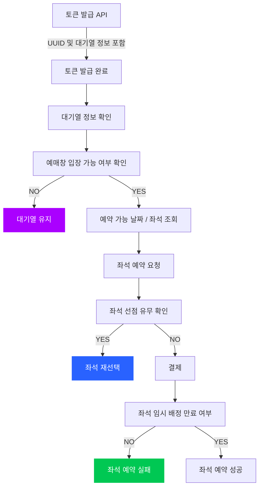
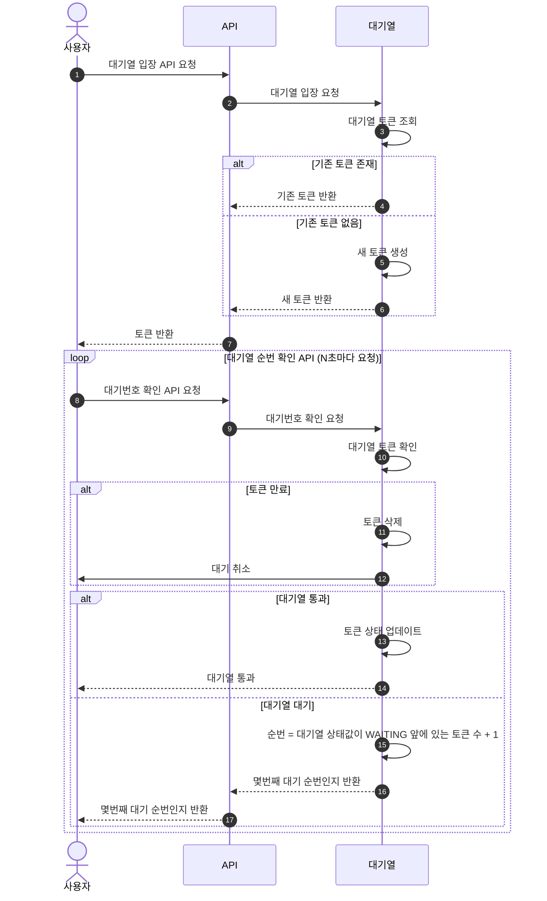
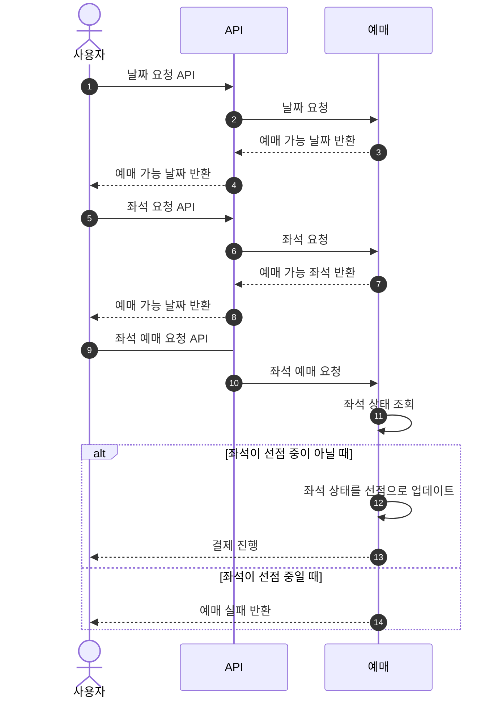
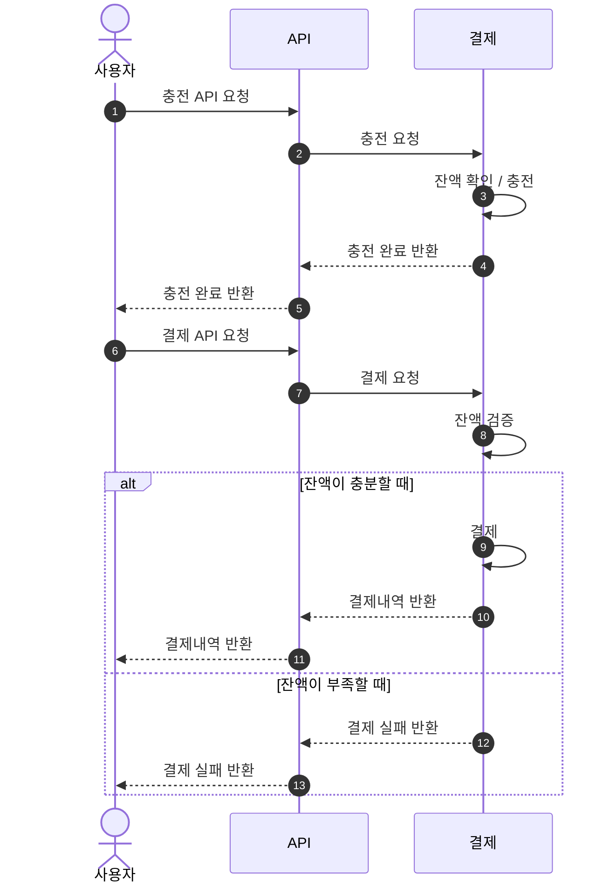
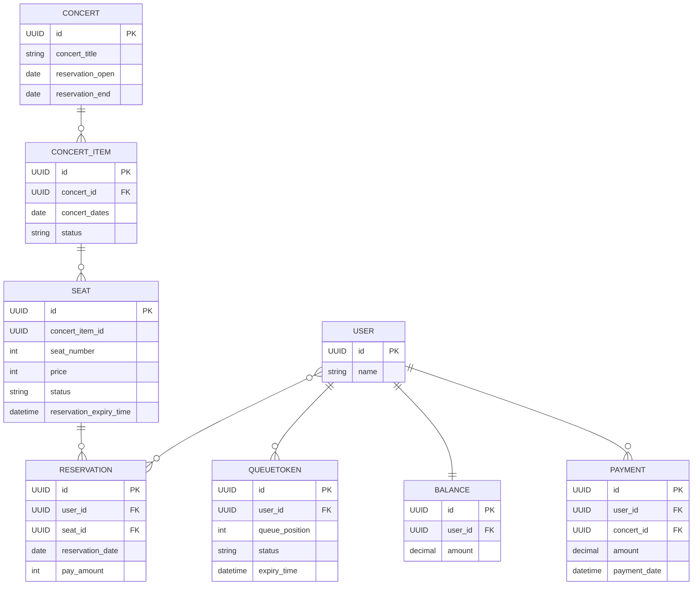

[마일스톤](https://github.com/users/jjuya21/projects/2)

[회고](https://www.notion.so/STEP-10-1293baa346948054a5e4da68cb65eb3f)

<details>
  <summary>동시성 락</summary>

  <details>
    <summary>좌석 점유</summary>

  ```
  시나리오: 동일한 좌석에 대해 다수의 예약 요청이 동시에 발생한다.
  
  문제: 실제 좌석에 대한 예매는 하나만 존재해야하지만 여러 개가 존재할 수 있다.
  
  발생 가능성: 높음
  
  재시도 필요 유무: 무
  
  해결: 좌석점유에서 분산락을 이용해 한 좌석에 대해 최초 좌석 예매 요청 이후 모두 throw 한다.
  
  이유: 현재 로직은 좌석 점유 후 예약 인원 변경이 되고 있습니다.
  좌석 점유에 분산락을 적용하여 요청 좌석이 EMPTY 상태 이외에는 전부 throw 시키게 되면
  동시성 제어가 된다고 판단했습니다.
  부하 측면에서는 재시도가 없다는점, 그리고 최초 좌석 점유 경쟁 이후에 모든 요청은 
  예약가능 좌석 조회 READ에서 예약 불가 좌석으로 노출될 것이기 떄문에
  좌석별 최초 점유 경쟁 이후엔 부하가 크지 않을 것이라 생각 했습니다.
  ```

| 스레드 수            | 낙관적 락 | 비관적 락 | redis 분삭락 |
|------------------|-------|-------|-----------|
| 스레드 1000개시 수행 속도 | 1.2s  | 1.1s  | 1.0s      |

  </details>

  <details>
    <summary>충전 / 결제</summary>

  ```
  시나리오: 동일한 잔액에 대해 다수의 결제 / 충전 요청이 동시에 발생한다.
  
  문제: 실제 잔액에 대한 요청은 차례대로 진행이되어야 한지만 동시에 요청이 들어와
       올바르지 못한 결과가 나온다.
  
  발생 가능성: 낮음
  
  재시도 필요 유무: 무
  
  해결: 잔액에서 낙관락을 이용해 최초 요청 이후 모두 throw 한다.
  
  이유: 발생 가능성이 많지 않고 동시에 들어온 중복 요청 발생 시 의도하지 않은 결제나 충전이 발생하면 안된다고 판단했습니다.
  
  ** 만약 충전에 대한 중복 요청은 처리되어야 한다면 충전 요청은 분산락으로 구현할 것 같습니다.
  ```

- 충전

| 스레드 수            | 낙관적 락 | 비관적 락 | redis 분삭락 |
|------------------|-------|-------|-----------|
| 스레드 1000개시 수행 속도 | 1.2s  | 2.3s  | 4.0s      |

- 결제

| 스레드 수            | 낙관적 락 | 비관적 락 | redis 분삭락 |
|------------------|-------|-------|-----------|
| 스레드 1000개시 수행 속도 | 1.2s  | 2.4s  | 4.1s      |

  </details>
생각보다 분산락이 성능이 안좋은 것 같지만 단일 서버라 그런거라 생각한다.
</details>

**예매하기 FLOW CHART**









테이블 ERD



## 기술 스택

### Web Application Server

- **Java 21**
- **Spring Boot**
    - Spring Web
    - Spring Validation
    - Spring Security
    - Jwt
    - Spring Data JPA
    - Lombok

### Database

- **H2** (Domain)

### Test

- **Spring Boot Test**

## 패키지 구조

```
/
├── interfaces
│   ├── api
│   │    └── Controller.java
│   └── (도메인)
│       ├── Request.java
│       └── Response.java
├── application
│   ├── common
│   └── (도메인)
│       └── Facade.java
├── domain
│   ├── common
│   └── (도메인)
│       ├── Entity.java
│       ├── Service.java
│       └── Repository.java
├── infrastructure
│   ├── jwt
│   └── persistence
│       └── (도메인)
│           ├── jpa
│           │   ├── JpaRepository.java
│           │   └── QueryDslRepository.java
│           └── RepositoryImpl.java
└── config
└── Config.java
```