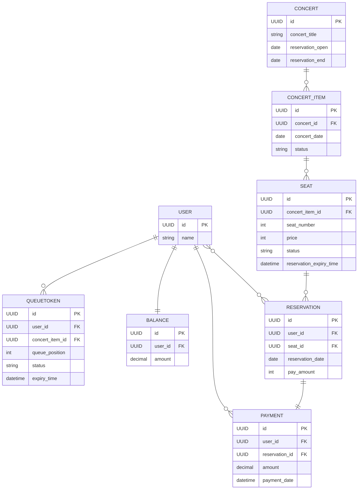

[마일스톤](https://github.com/users/jjuya21/projects/2)

[회고](https://www.notion.so/STEP-10-1293baa346948054a5e4da68cb65eb3f)

<details>
  <summary>동시성 락</summary>

  <details>
    <summary>좌석 점유</summary>

  ```
  시나리오: 동일한 좌석에 대해 다수의 예약 요청이 동시에 발생한다.
  
  문제: 실제 좌석에 대한 예매는 하나만 존재해야하지만 여러 개가 존재할 수 있다.
  
  발생 가능성: 높음
  
  재시도 필요 유무: 무
  
  해결: 좌석점유에서 분산락을 이용해 한 좌석에 대해 최초 좌석 예매 요청 이후 모두 throw 한다.
  
  이유: 현재 로직은 좌석 점유 후 예약 인원 변경이 되고 있습니다.
  좌석 점유에 분산락을 적용하여 요청 좌석이 EMPTY 상태 이외에는 전부 throw 시키게 되면
  동시성 제어가 된다고 판단했습니다.
  부하 측면에서는 재시도가 없다는점, 그리고 최초 좌석 점유 경쟁 이후에 모든 요청은 
  예약가능 좌석 조회 READ에서 예약 불가 좌석으로 노출될 것이기 떄문에
  좌석별 최초 점유 경쟁 이후엔 부하가 크지 않을 것이라 생각 했습니다.
  ```

| 스레드 수            | 낙관적 락 | 비관적 락 | redis 분삭락 |
|------------------|-------|-------|-----------|
| 스레드 1000개시 수행 속도 | 1.2s  | 1.1s  | 4.1s      |

  </details>

  <details>
    <summary>충전 / 결제</summary>

  ```
  시나리오: 동일한 잔액에 대해 다수의 결제 / 충전 요청이 동시에 발생한다.
  
  문제: 실제 잔액에 대한 요청은 차례대로 진행이되어야 한지만 동시에 요청이 들어와
       올바르지 못한 결과가 나온다.
  
  발생 가능성: 낮음
  
  재시도 필요 유무: 무
  
  해결: 잔액에서 낙관락을 이용해 최초 요청 이후 모두 throw 한다.
  
  이유: 발생 가능성이 많지 않고 동시에 들어온 중복 요청 발생 시 의도하지 않은 결제나 충전이 발생하면 안된다고 판단했습니다.
  
  ** 만약 충전에 대한 중복 요청은 처리되어야 한다면 충전 요청은 분산락으로 구현할 것 같습니다.
  ```

- 충전

| 스레드 수            | 낙관적 락 | 비관적 락 | redis 분삭락 |
|------------------|-------|-------|-----------|
| 스레드 1000개시 수행 속도 | 1.2s  | 2.3s  | 4.0s      |

- 결제

| 스레드 수            | 낙관적 락 | 비관적 락 | redis 분삭락 |
|------------------|-------|-------|-----------| 
| 스레드 1000개시 수행 속도 | 1.2s  | 2.4s  | 4.1s      |

  </details>
분산 환경에서는 분산락의 성능이 더 좋아질 거라 생각한다.
</details>

<details>
  <summary>Redis 활용 대기열</summary>

- Redis를 선택한 이유

    - 고성능 / 빠른 속도

      대기열 로직은 실시간 처리가 중요하기 때문에, 기존 DB 조회 방식보다 Redis를 활용하여 더 빠른 속도를 확보할 필요가 있었습니다.

    - TTL 기반 캐싱 전략

      Redis의 TTL 기능을 통해 대기열 토큰을 자동으로 만료 및 삭제할 수 있어 데이터의 유효 기간을 효율적으로 관리할 수 있습니다. DB와는 달리 만료된 데이터를 별도로 삭제하는 관리 작업이 필요
      없으며, 이를 통해 불필요한 스케줄링 로직을 제외할 수 있었습니다.

- Redis사용의 장점

  토큰은 영구 저장이 필요하지 않은 데이터이므로 영속성이 요구되지 않습니다. Redis를 사용해 기존 DB에 저장할 때보다 훨씬 효율적으로 토큰을 관리할 수 있습니다.

- 대기열 변화

    - 기존 대기열 (은행창구 방식)

      | 단계                       | 설명                                                                                     |
            |----------------------------|------------------------------------------------------------------------------------------|
      | 1. 토큰 생성               | 새로운 토큰을 생성                                               |
      | 2. 대기 상태 추가        | 토큰에 **대기 상태**, **만료 시간** 부여                                            |
      | 3. 대기 순번 추가          | 대기열에서 가장 큰 대기 순번을 조회 후 **대기 순번**을 부여                                          |
      | 4. DB에 토큰 저장          | **토큰 / 상태 / 순번** 을 저장
      | 5. n초마다 통과 토큰 확인   | 주기적으로, n초마다 **통과된 토큰 수**가 m개 이하인지 확인                               |
      | 6. 통과 여부 결정          | 통과된 토큰이 m개 이하일 경우, 대기열에서 **가장 높은 대기 순번** 이후의 토큰을 **통과 상태**로 변경 |

    - 현재 대기열 (놀이공원 방식)

      | 단계                       | 설명                                                                                     |
            |----------------------------|------------------------------------------------------------------------------------------|
      | 1. 토큰 생성               | 새로운 토큰을 생성                                             |
      | 2. 대기열에 추가        | 토큰을 대기열에 추가 (생성 시간으로 **sorted set**에 추가)                                            |
      | 3. n초마다 토큰 통과   | 주기적으로, n초마다 대기열에서 m개 씩 **POP** 후 토큰을 키로 통과 토큰 저장                               |
      | 4. 만료 시간 추가          | 토큰에 만료시간 부여 |

  -토큰 만료 시간 확인 스케줄러를 Redis의 TTL로 구현하여 로직 생략

  -기존 대기열 동작의 많은 DB조회로 인한 성능 저하를 Redis사용과 놀이공원 방식으로 바꾸며 조회 생략

    - 기존 대기 순번 생성

      대기 토큰 조회 -> 없다면 1을 부여 / 존재한다면 대기 토큰들의 대기 순번 중 가장 높은 수 + 1 부여

    - 현재 대기 순번 생성

      대기열 삽입 시간을 기준으로 정렬되어 순서대로 삽입

</details>

**예매하기 FLOW CHART**


테이블 ERD



## 기술 스택

### Web Application Server

- **Java 21**
- **Spring Boot**
    - Spring Web
    - Spring Validation
    - Spring Data JPA
    - Lombok

### Database

- **H2** (Domain)

### Test

- **Spring Boot Test**

## 패키지 구조

```
/
├── interfaces
│   ├── api
│   │    └── Controller.java
│   └── (도메인)
│       ├── Request.java
│       └── Response.java
├── application
│   ├── common
│   └── (도메인)
│       └── Facade.java
├── domain
│   ├── common
│   └── (도메인)
│       ├── Entity.java
│       ├── Service.java
│       └── Repository.java
├── infrastructure
│   ├── jwt
│   └── persistence
│       └── (도메인)
│           ├── jpa
│           │   ├── JpaRepository.java
│           │   └── QueryDslRepository.java
│           └── RepositoryImpl.java
└── config
└── Config.java
```
